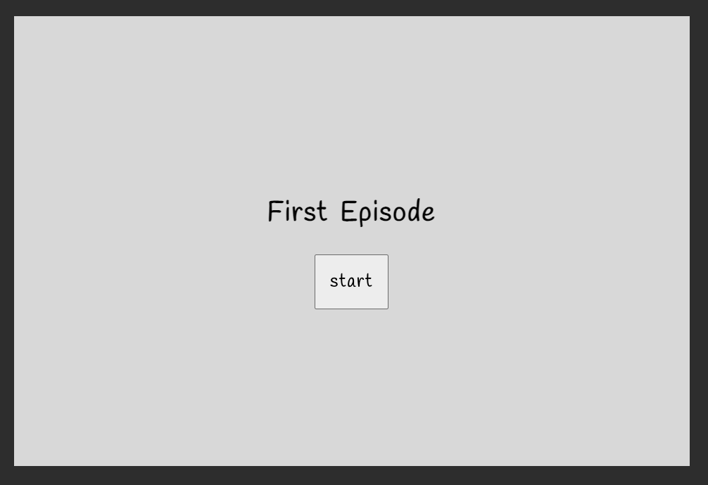
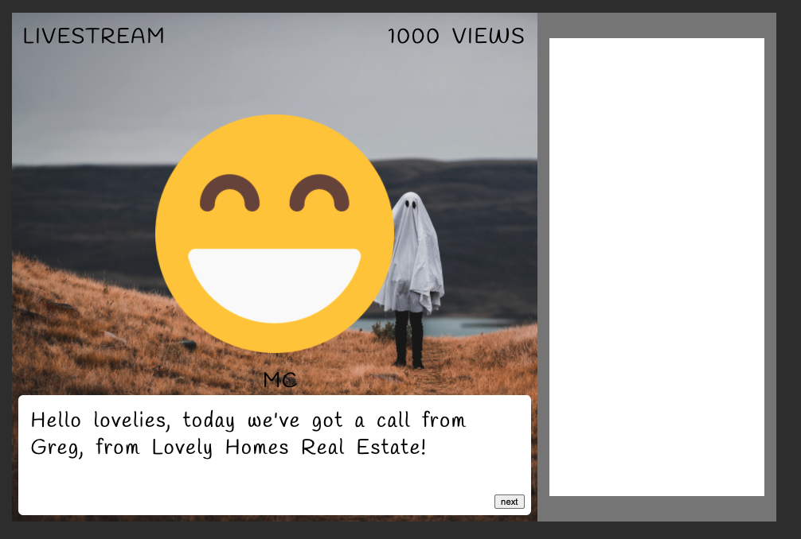
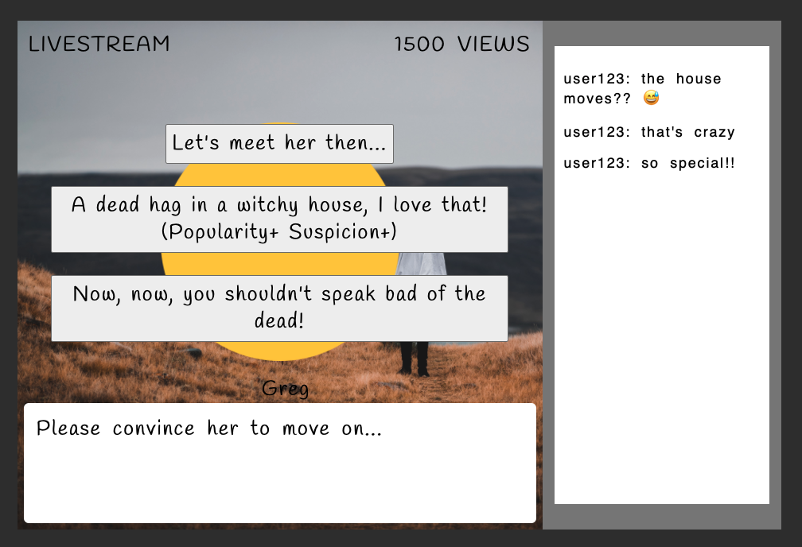
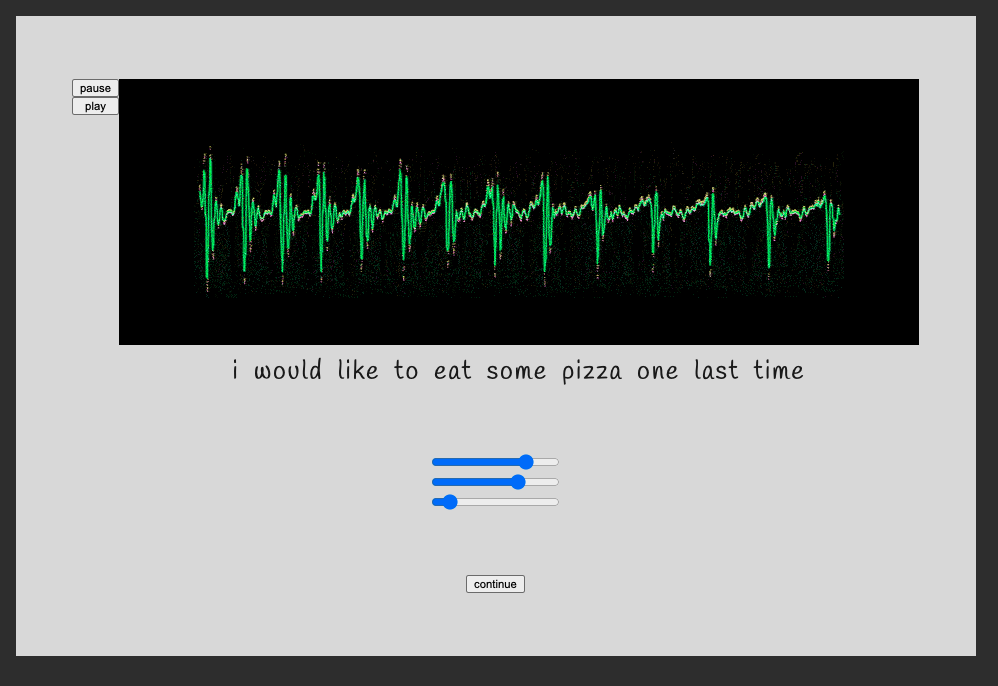
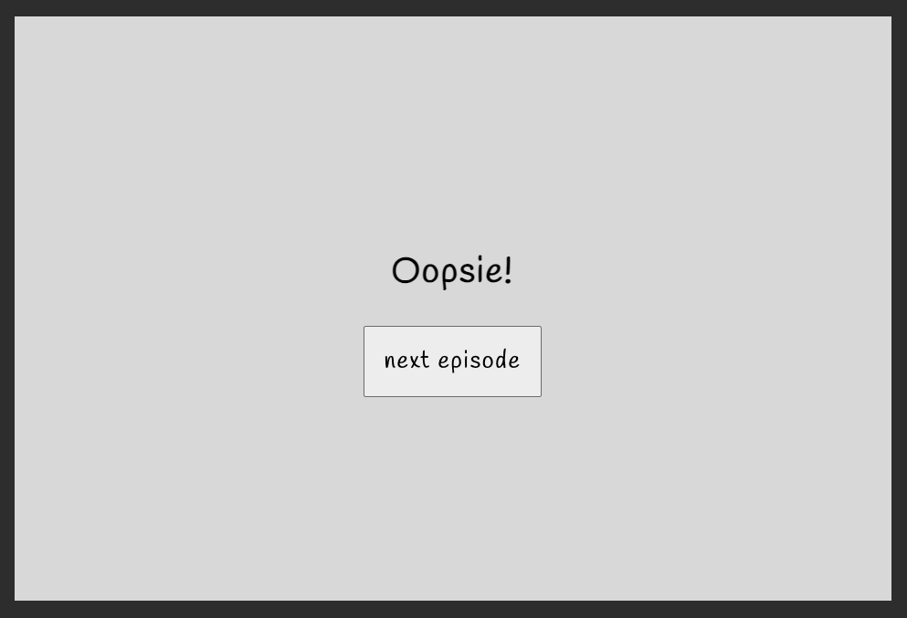

# Ghost Interpreter

A ghostly narrative game for [Narrative Driven Jam 6 on itch.io](https://itch.io/jam/narrative-driven-jam-6). It is currently a work in progress.

Created by
- Reagan (IfThenCreate), programmer 
- trout (False Trout) composer
- Emma (LaChapeliere) narrative designer
- Anni (Nightsparrow) graphics artist

## TODO:

### tech
- [x] create loading screen
- [x] create title screen
- [x] create episode intro screen
- [x] create dialogue screen
- [x] add dialogue functionality to progress story by selecting a response
- [x] add dialogue functionality to progress story by clicking next
- [x] add dialogue functionality to progress story with space or click
- [x] add livestream chat functionality to reflect a mood
- [x] reflect livestream popularity in views
- [x] add dialogue functionality to show character with different emotions
- [x] add audio puzzle screen
- [x] add audio puzzle slider functionality
- [x] add audio puzzle caption
- [x] create epilogue screens
- [x] make epilogue screen dynamic
- [ ] play background music
- [ ] add audio puzzle dynamic visual feedback
- [ ] fix preloading assets, there's a delay in displaying background images

#### stretch goals
- [ ] make dialogue text appear incrementally
- [ ] add settings menu

### integration
- [x] pick font and sizing to determine max text length
- [ ] finalize what loading screen should look like (add logo or animation)
- [ ] finalize what title screen should look like (add credits and illustrations)
- [ ] add visual assets to dialogue screen
- [ ] add visual aseets to audio puzzle screen
- [ ] add episode content
- [ ] epilogue screens

### audio needed
- [ ] ghost tracks for each episode
- [ ] static 1
- [ ] static 2
- [ ] background music for each episode 

### art assets needed

#### general
- [ ] cover photo (for itch.io page)
- [ ] favicon (for itch.io page)

#### loading screen

- [ ] logo for loading screen (or decide on animation)
- should also decide on a background color here

#### title screen

- [ ] possible background art? this screen is 960x640px
- [ ] possible illustrated title, or just use a font? 
- [ ] start button (either just background, or background plus words and i can add discernible text with an aria label) any size
- also should add content warning here

#### episode intro screen (for each episode)

- [ ] possible background art, (960x640px) or just pick background color
- [ ] possible illustrated title, or just use a font? 
- [ ] start button (either just background, or background plus words and i can add discernible text with an aria label)

#### dialogue screen (for each episode)

- I'm just using placeholders for the character and the background, ignore those. 
- [ ] episode background art (660x640px, could be adjusted if we shrink livestream section)
- [ ] "next" button or icon for user to click to progress (any size or shape)
- [ ] character art (including emotion variants) (less than 660px wide and 490px tall, that's the absolute max of the space minus the dialogue space at the bottom)
- [ ] livestream overlay background? unsure if you want to draw the part on the right, it's (300 x 640px, and the inner white chat part can be whatever size, currently 270x576px)
- [ ] do you want to add a background for the dialogue box at the bottom? how should the speaker name render?

- [ ] possibly backgrounds for these response options? Tricky because they may vary in size, or we pick a max and limit them all. 

#### audio puzzle screen

- [ ] background art/translator art. this page can look however you want, should fit into the screen size of (960x640px). might vary per episode if we want to show the ghosts?
- [ ] play/pause buttons
- [ ] soundwave art for paused, bad, ok, and good. can be any size, but variants for showing how accurate the sliders are would be helpful.
- [ ] slider design? unsure how much control we have
- [ ] continue button

#### epilogue screens

- [ ] I think we'll show a different illustration for each of the 4 episode endings?
- [ ] continue button
- there's also the game over screen for raising too much suspicion, and the final game ending. Unsure what those look like. 

NOTE: for all buttons with custom art, unsure if you want to draw the words on them, or leave the text to be written on top. Let me know.
