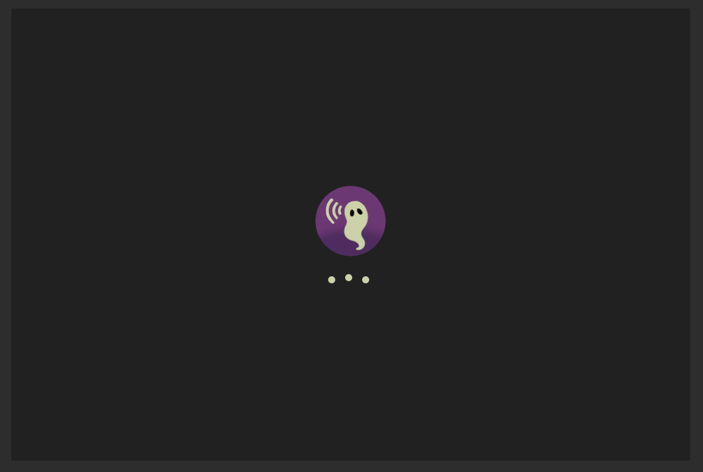
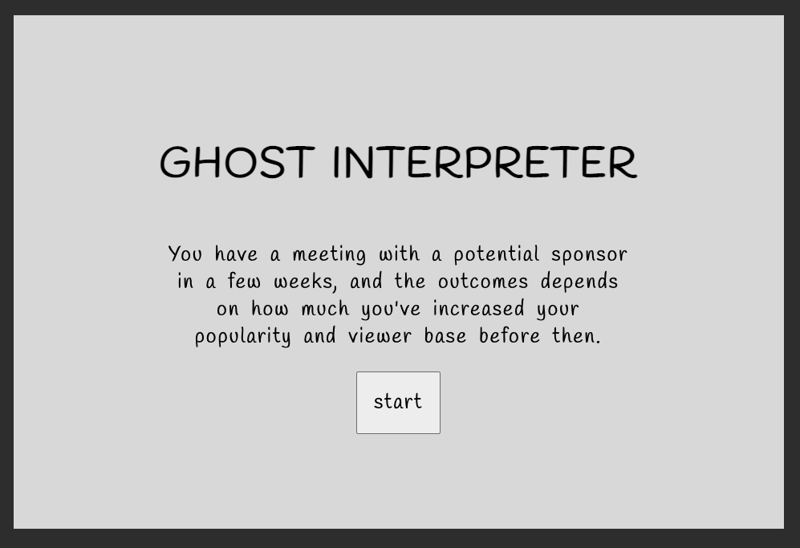
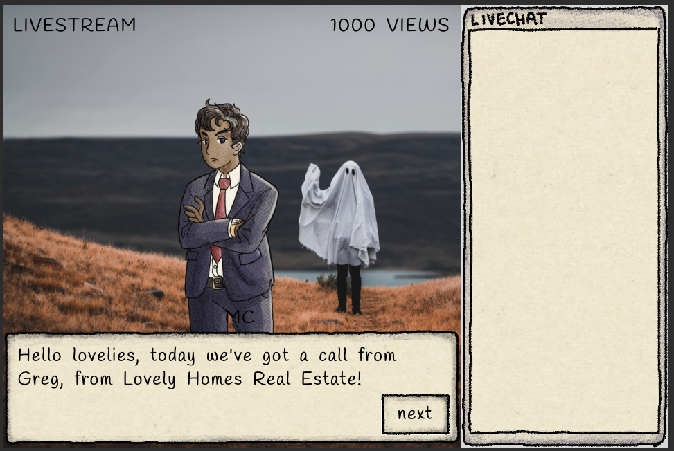
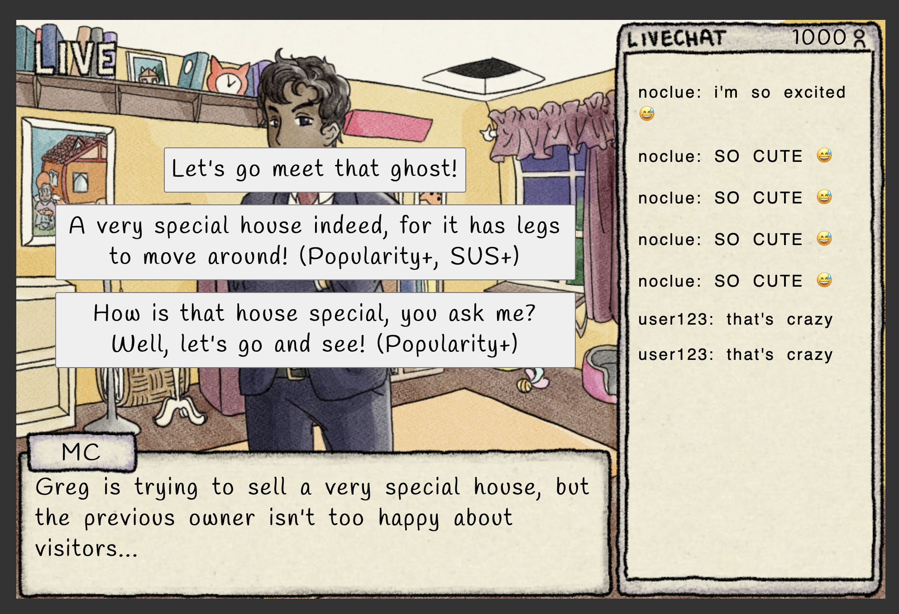
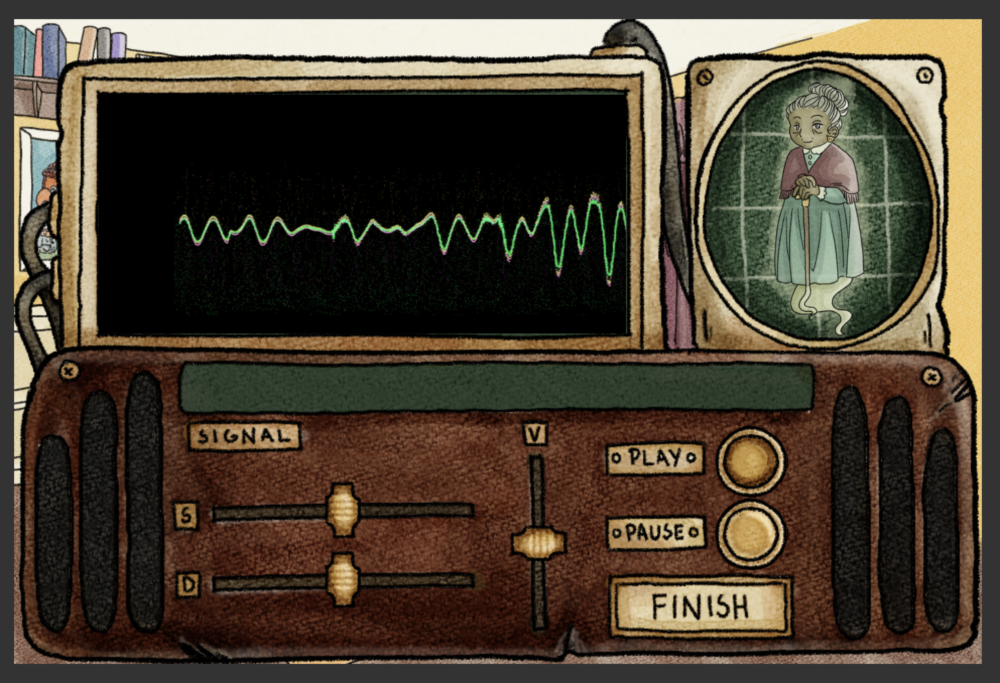
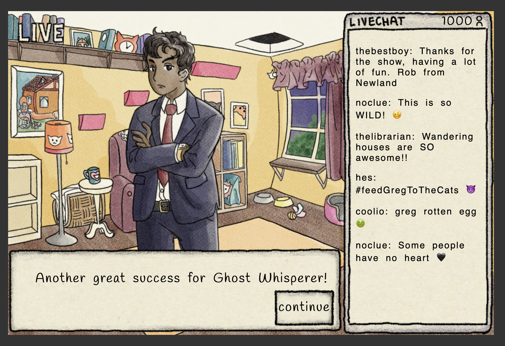
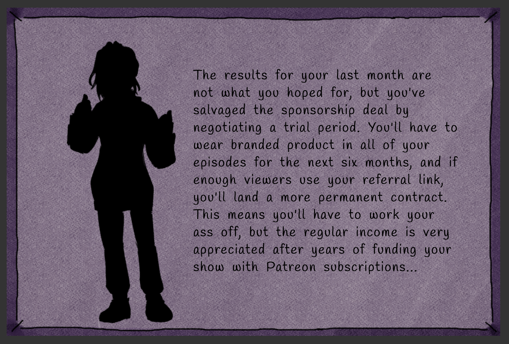

# Ghost Interpreter

A ghostly narrative game for [Narrative Driven Jam 6 on itch.io](https://itch.io/jam/narrative-driven-jam-6). It is currently a work in progress.

Created by
- Reagan (IfThenCreate), programmer 
- trout (False Trout) composer
- Emma (LaChapeliere) narrative designer
- Anni (Nightsparrow) graphics artist

# TODOs:

### tech
- [x] allow epilogues to update pop/sus
- [x] add new assets
- [x] fix preloading assets, there's a delay in displaying background images
- [x] add audio files
- [ ] fix main theme bug


### audio needed
- [x] haunted house ghost request
- [x] haunted house music
- [x] pizza house ghost request
- [x] pizza house music
- [x] stars house ghost request
- [x] stars house music
- [x] static 1
- [x] static 2

### art assets needed
- [x] cover photo (for itch.io page)
- [x] favicon (for itch.io page)
- [x] main character sprite (excited)
- [x] main character sprite (sad)
- [x] Finalized title screen illustration (960x640px)
- [x] soundwave art for paused audio (523px x 237px)
- [x] soundwave art for bad audio (523px x 237px)
- [x] soundwave art for ok audio (523px x 237px)
- [x] soundwave art for good audio (523px x 237px)

#### stretch goals
- [ ] make dialogue text appear incrementally
- [ ] add settings menu
- [ ] fade in audio puzzle

# EPISODE WRITING:

<p>There are two files that writing needs to be added to. <p>

[episodes.js](./episodes.js) has an overview of all episodes and their constant information. Example: 

```js
   {
    episodeTitle: "The Haunted House",
    backgroundImg: FIELD_BACKGROUND,
    episodeMusic: CREEPY_MUSIC,
    ghostAudio: PIZZA_AUDIO,
    ghostAudioCaption: "i would like to eat some pizza one last time",
    textNodesBeforeAudio: hauntedHouseDialogue1,
    textNodesAfterAudio: hauntedHouseDialogue2
  }
```
- _episodeTitle_: this is what renders on the Episode Intro screen
- _backgroundImage_: this is what renders as the episode background during dialogue screens. it's represented as aa url to the filename. it should also be added in [loading.js](./loading.js); I'll do that once they're finalized.
- _episodeMusic_: this is what plays as the episode background music. It's represented as a url to the filename. It should also be added to the loading list. 
- _ghostAudio_: this is what plays for the audio puzzle. it's represented as a link to the file name. It should also be added to the loading list. 
- _ghostAudioCaption_: The text being said in the ghostAudio, this is used to populate the caption on the translator screen
- _textNodesBeforeAudio_: This links the text before the audio puzzle. More details on text nodes below. 
- _textNodesAfterAudio_: This links the text after the audio puzzle. More details on text nodes below. 

Each episode has a js file to hold its dialogue, epilogues, and possible chat segments. [dialogue-hauntedhouse.js](./dialogue-hauntedhouse.js) is the file for the Haunted House episode. The file contains the following:

- Constant `GREG_GRUMPY` with the url to the greg_grumpy image. There should be one of these for each possible mood/image of the character. 
- Array `HAUNTEDHOUSE_EXCITED`, which is an array to represent chat moods. 
- Array `HAUNTEDHOUSE_EPILOGUES`, the possible endings for the episode (currently, just the text to show. This could expand to have a final illustration)
- Array `hauntedHouseDialogue1`, this is the dialogue before the audio puzzle
- Array `hauntedHouseDialogue2`, this is the dialogue after the audio puzzle

The chatMoods array (`HAUNTEDHOUSE_EXCITED`) is just one example, there should be one of these for each possible mood that can trigger. It's separated into sections for LOW suspicion (under 3; we can adjust these thresholds), MED (3-5), and HIGH (over 5). One of these will appear at a time in the chat when triggered. 

For the text nodes, here's an example where there are no options on screen:
```js
  {
    id: 1,
    text: "Hello lovelies, today we've got a call from Greg, from Lovely Homes Real Estate!",
    speakerName: "MC",
    characterImg: GREG_GRUMPY,
    next: 2
  }
```
- _id_: this is the ID of the text node, and how it links to other nodes
- _text_: this is the text displayed in the dialogue box
- _speakerName_: this is the speaker's name displayed above the dialogue box
-_characterImg_: this is the constant that contains the character art to be displayed (ex: GREG_GRUMPY, GREG_NEUTRAL, etc should all be held as constants at the start of the file)
-_next_: this is where the story will go when the player clicks next, it is the ID of the text node you want to go to

NOTE:  If the "nextText" is "FINISHEPISODE" (represented by the `FINISHEPISODE` constant), the episode will proceed to the epilogue after that.

For a text node with options on screen:
```js
{
  id: 2,
  text: "Greg is trying to sell a very special house, but the previous owner isn't too happy about visitors...",
  speakerName: "MC",
  characterImg: GREG_GRUMPY,
  options: [
    {
      text: "Let's go meet that ghost!",
      chatMoods: HAUNTEDHOUSE_EXCITED,
      nextText: 3,
    },
    {
      text: "A very special house indeed, for it has legs to move around! (Popularity+, SUS+)",
      popularity: 5,
      suspicion: 3,
      nextText: 3,
      chatMoods: HAUNTEDHOUSE_EXCITED
    },
    {
      text: "How is that house special, you ask me? Well, let's go and see! (Popularity+)",
      chatMoods: HAUNTEDHOUSE_EXCITED,
      popularity: 1,
      nextText: 3,
      setEpilogue: 4
    }
  ]
}
```
These nodes have an `options` section instead of a `next`. The options array can have the following fields: 

- _text_: the test displayed in the response option box
- _chatMoods_ (optional): the chatMood arrays (defined above) to pull from. If this is present, one chat segment will be selected for each mood defined, depending on the suspicion
- _popularity_ (optional): If this is present, the popularity will change by this amount when it's selected. Can be positive or negative. 
- _suspicion_ (optional): If this is present, the suspicion will change by this amount when it's selected. Can be positive or negative. 
- _nextText_: the next text node id, where clicking the response will take you to
- _setEpilogue_ (optional): This will cause the epilogue to be set, refering to an id in the epilogues array. 

NOTE: if the "nextText" is "AUDIOGAME" (represented by the `START_PUZZLE` constant), the audio puzzle will start once that option is selected. 

# screenshots

#### loading screen


#### title screen


#### episode intro screen (for each episode)


#### dialogue screen (for each episode)




#### audio puzzle screen


#### episode epilogue screens


#### game ending screen

